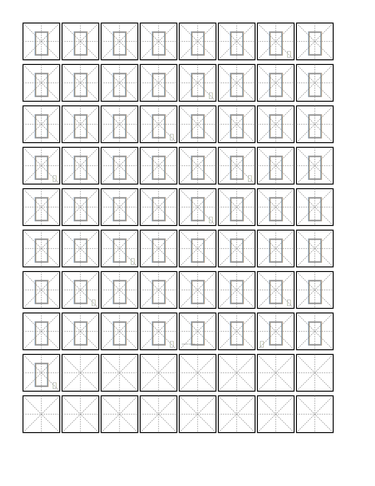

# Chinese Copybook Generator（中文字帖生成器）

A Python tool to generate Chinese character practice sheets in SVG format.

## Preview



## Usage

After installation, you can use the tool in two ways:

1. As a command-line tool:

```bash
copybook [OPTIONS] TEXT_FILE
```

2. As a Python module:

```bash
python -m copybook.main [OPTIONS] TEXT_FILE
```

### Arguments

- `TEXT_FILE`: Path to a text file containing Chinese characters to practice

### Options

- `-p, --page`: Page size (a4, letter, legal) [default: letter]
- `-g, --grid`: Grid size for each character [default: 80]
- `--page-margin`: Page margins in pixels [default: 20]
- `--grid-spacing`: Spacing between grids [default: 5]
- `--line-spacing`: Extra spacing between lines [default: 10]
- `--font`: Font family for characters [default: TianYingZhangKaiShu]
- `--font-size`: Font size in pixels [default: 60]
- `--font-color`: Font color [default: gray]
- `--font-opacity`: Font opacity (0.0-1.0) [default: 0.8]
- `--include-punctuation`: Include punctuation marks from the text

### Example

```bash
# Basic usage
copybook sample.txt

# With custom options
copybook -p a4 --grid 100 --font-size 80 --include-punctuation chinese_text.txt
```

The tool generates an SVG file named `book.svg` which can be opened in any web browser or vector graphics editor.
