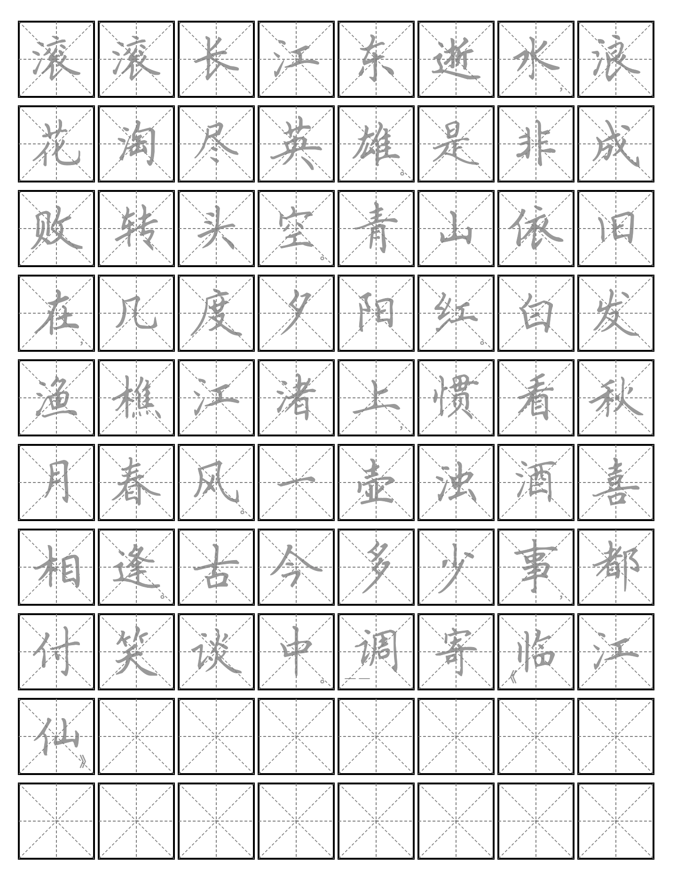

# Chinese Calligraphy Practice Sheet Generator

Generate PDF practice sheets for Chinese calligraphy with proper character grids and punctuation positioning.

## Example



## Features

- **PDF Output**: High-quality printable practice sheets
- **Smart Punctuation**: Handles Chinese and English punctuation positioning
- **Multiple Paper Sizes**: A4, Letter, Legal
- **Customizable Grids**: Adjustable size, spacing, and layout

## Usage

```bash
copybook [OPTIONS] TEXT_FILE
```

### Options

- `-p, --page`: Page size (a4, letter, legal) [default: letter]
- `-g, --grid`: Grid size [default: 40]
- `-o, --output`: Output PDF filename [default: book.pdf]
- `--font`: Font family [default: 田英章楷书]
- `--font-size`: Font size [default: 32]
- `--font-opacity`: Transparency (0.0-1.0) [default: 0.7]

### Examples

```bash
# Basic usage
copybook text.txt

# Custom output and grid size
copybook -o practice.pdf --grid 50 text.txt
```
